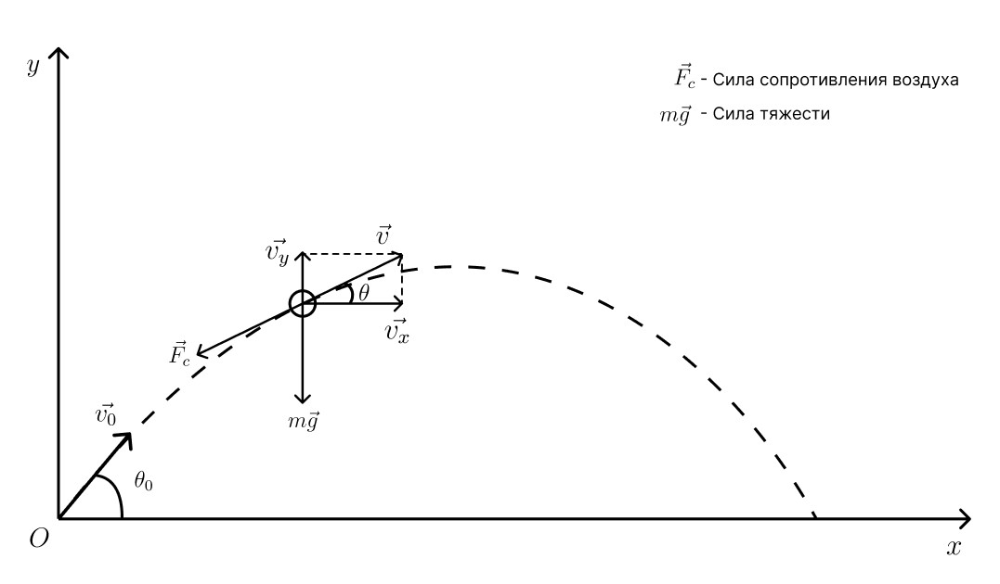
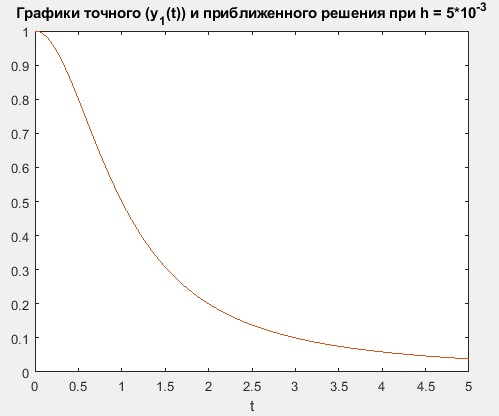
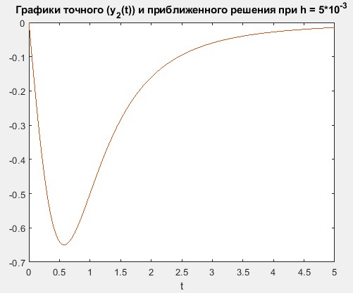
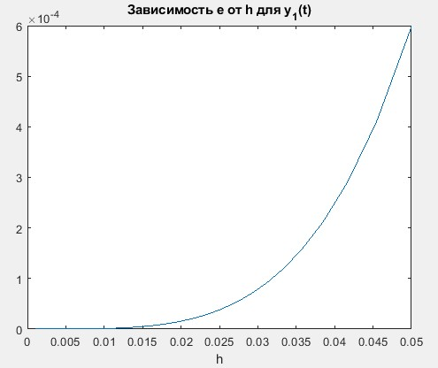
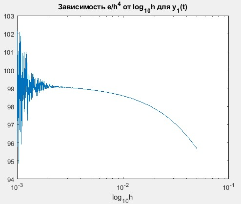
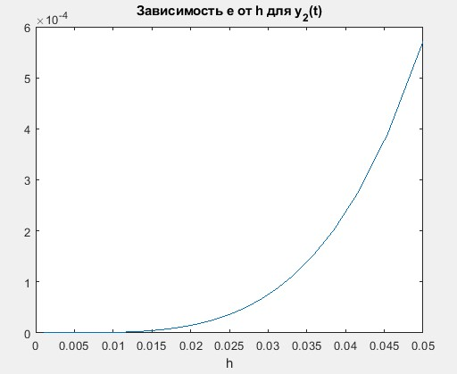
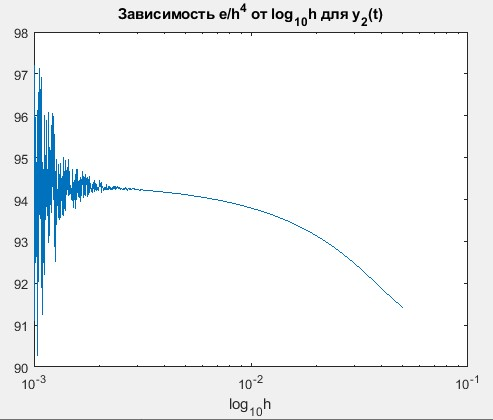
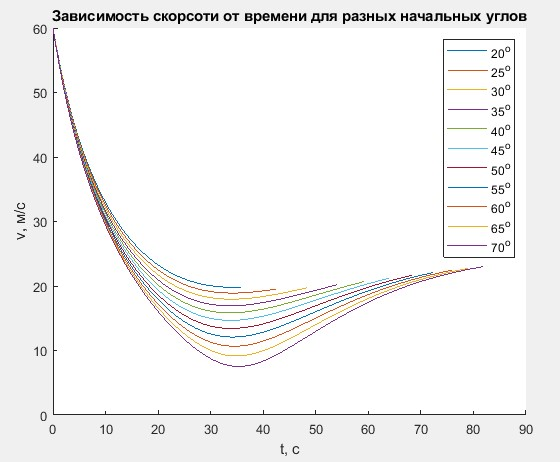
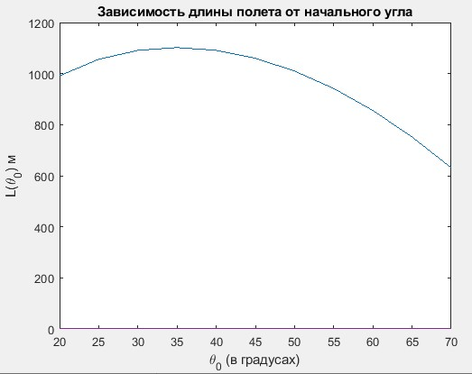

# Решение системы дифференциальных уравнений для полета снаряда методом Рунге-Кутты 4-го порядка точности #

## Постановка задачи ##
Рассмотрим полет снаряда, выпущенного под углом к горизонту, при следующих предположениях:

> Сила сопротивления воздуха пропорциональна квадрату скорости снаряда;

> Дальность полета не превышает 10 км;

> Боковой ветер отсутствует.

Уравнения движения центра масс снаряда в проекциях на оси координат:

Здесь m - масса снаряда, v - скорость движения, &theta; - угол между касательной к траектории и осью Ox, g - ускорение свободного падения, S - площадь поперечного сечения снаряда, &rho; - плотность воздуха, C - коэффициент лобового сопротивления снаряда.

## Преобразование уравнений ##
Для численного решения удобно преобразовать два уравнения второго порядка к четырем уравнениям первого:

## Метод Рунге-Кутты 4 порядка ##

## Тестирование метода ##
Необходимо проверить метод на следующей системе уравнений на отрезке [0;5]:

Данная система имеет следующие точные решения:

Получившиеся графики точных и приближенных решений:

Графики зависимости максимальной погрешности решения $e$ и $e/h^4$ от выбранного шага h.

## Решение основной задачи  ##

Начальные условия:

Получившиеся графики

Максимальная длина полета достигается при начальном угле 35 градусов.
