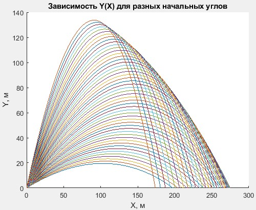
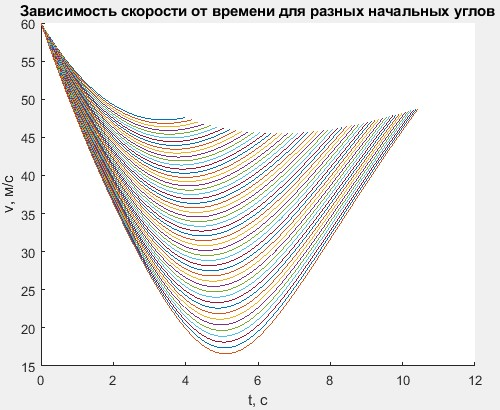
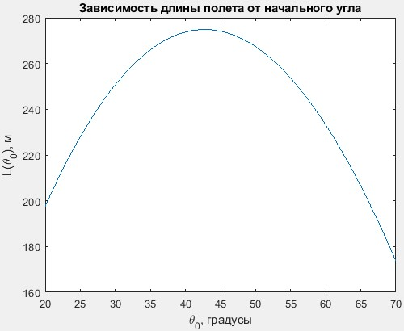

# Решение системы дифференциальных уравнений для полета снаряда методом Рунге-Кутты 4-го порядка точности #

## Постановка задачи ##

Рассмотрим полет снаряда, выпущенного под углом к горизонту, при следующих предположениях:

- Сила сопротивления воздуха пропорциональна квадрату скорости снаряда;

- Дальность полета не превышает 10 км;

- Боковой ветер отсутствует.

Уравнения движения центра масс снаряда в проекциях на оси координат: 

$$x'' = -C\rho Sv^2\cos(\theta)/2m$$

$$y'' = -C\rho Sv^2\sin(\theta)/2m - g$$

Здесь $m$ - масса снаряда, $v$ - скорость движения, &theta; - угол между касательной к траектории и осью $Ox$, $g$ - ускорение свободного падения, $S$ - площадь поперечного сечения снаряда, &rho; - плотность воздуха, $C$ - коэффициент лобового сопротивления снаряда.

## Преобразование уравнений ##

Для численного решения удобно преобразовать два уравнения второго порядка к четырем уравнениям первого: 

$$x' = v\cos(\theta)$$

$$y' = v\sin(\theta)$$

$$v' = -C\rho Sv^2/2m -g\sin(\theta)$$

$$\theta' = -g\cos(\theta)/v$$

## Метод Рунге-Кутты 4 порядка с шагом $h$ ##

$$k_1 = f(t_n, y_n)$$

$$k_2 = f(t_n + h/3, y_n + hk_1/3)$$

$$k_3 = f(t_n + 2h/3, y_n - hk_1/3 + hk_2)$$

$$k_4 = f(t_n + h, y_n + hk_1 - hk_2 + hk_3)$$

$$y_{n+1} = y_n + h(k_1 + 3k_2 + 3k_3 + k_4)/8$$

## Тестирование метода ##

Необходимо проверить метод на следующей системе уравнений на отрезке $t\in [0;5]$:

$$y_1' = y_2$$

$$y_2' = 2y_1^2(4t^2y_1 - 1)$$

Данная система имеет следующее точное решение:

$$y_1 = 1/(1 + t^2)$$

$$y_2 = -2t/(1+t^2)^2$$

Получившиеся графики точного и приближенного решений: 

Графики зависимости максимальной погрешности решения $e$ от $h$ и $e/h^4$ от $log_{10}(h)$ ($h$ - шаг). 

## Решение основной задачи  ##

### Силы, действующие на снаряд ###

### Начальные условия ###

$$x(0) = 0, y(0) = 0, \theta(0) = \theta_0, v(0) = v_0$$

### Параметры  ###

$$m = 45, C = 0.25, \rho = 1.29, S = 0.35, g = 9.81, v_0 = 60$$

### Получившиеся графики ###

Максимальная длина полета достигается при начальном угле 35 градусов.
